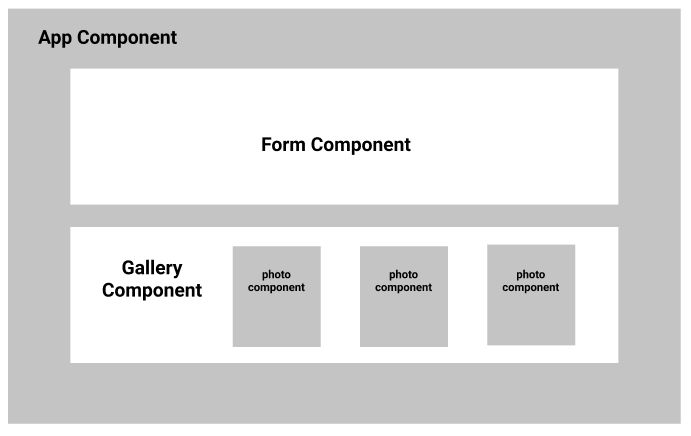

# Schedule for DAY3 - 1st of September 2019

### API requests review. (1 hour)

### Make an API request using fetch - project. (1 hour)

### Make an API request using fetch - review. (30 mins)

### Project 1 - Make a photo gallery with React (lecture). (1 hour)

**Instructions:**

- `cd` into your local repository, and create a folder and call it DAY3 and `cd` into it.
- Now type: `create-react-app gallery`
- After your react app has finished installing, go to `App.js` and clean up all the unnecessary code.

We're going to make a photo gallery using React. The user should be able to enter an image's link and submit it. Each time a user submits a photo, it should be added to the previous added images.

The gallery should look like this in react:

- The `Form` component: -
  1. Should have the text box (with a label) and submit button.
  2. Has a private state of its own to store the link of the image.
  - HINT: pass the state's data from `Form` component to `App` component using the button's `handleClick` function.
- The `Gallery` component:

  1. Is where we will have each `Photo` component added for each new image.

  - HINT: use map to return a `<Photo/>` component for each new image the user adds.

- The `Photo` component:
  - It should return an `` element.
  - The `` element should have an `src` attribute.
  - The `src` attribute value should be the link of the image.

HINT: Arrays in state aren't changed directly. You should use the **rest operator** to change Arrays state.
