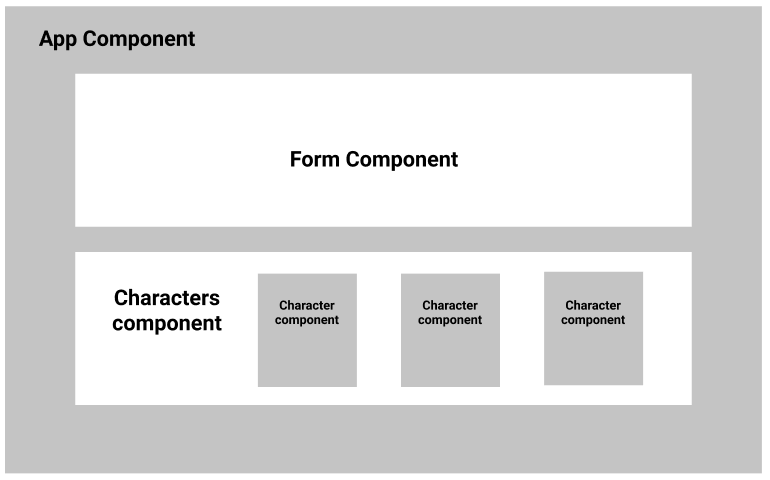

# Schedule for DAY3 - 26th of August 2019

### Project 1 - Make a photo gallery with React. (1 hour)

**Instructions:**

- `cd` into your local repository, and create a folder and call it DAY3 and `cd` into it.
- Now type: `create-react-app gallery`
- After your react app has finished installing, go to `App.js` and clean up all the unnecessary code.

We're going to make a photo gallery using React. The user should be able to enter an image's link and submit it. Each time a user submits a photo, it should be added to the previous added images.

The gallery should look like this in react:

- The `Form` component: -
  1. Should have the text box (with a label) and submit button.
  2. Has a private state of its own to store the link of the image.
  - HINT: pass the state's data from `Form` component to `App` component using the button's `handleClick` function.
- The `Gallery` component:

  1. Is where we will have each `Photo` component added for each new image.

  - HINT: use map to return a `<Photo/>` component for each new image the user adds.

- The `Photo` component:
  - It should return an `` element.
  - The `` element should have an `src` attribute.
  - The `src` attribute value should be the link of the image.

HINT: Arrays in state aren't changed directly. You should use the **rest operator** to change Arrays state.

### Project 1 - Make a photo gallery with React (Review). (1 hour)

### Project 2 - Make a search engine for Rick & Morty's Characters. (1 hour)

**Instructions**:

- `cd` into your local repository, make a folder and call it DAY2 and `cd` into it.

- In your terminal, run the following commands:

1. `npm install -g create-react-app`
2. `create-react-app character-search`

- cd into your react's project.

**The project**

We're going to build a search engine where we can look up Rick&Morty cartoon characters based on their species (human, humanoid, alien) and gender (male, female, genderless, unknown).

> How the site should look/work?

- There are two text boxes, one where the user can enter the `species` of the character and another where we can enter the `gender`.
- There has to be a submit button, when clicked, makes a request to the Rick&Morty site and gets back data based on what the user enters.
- Display each character in a card-like component that includes their: name, gender, status, species type, location and image.

  > How the project should look like in React?

  

> Where should I get the data from?

<a href="https://rickandmortyapi.com/documentation/" target="_blank">rickandmortyapi</a> is going to be the site we make requests to. It has some simple documentation to show you how you can customize your requests.

### Project 2 - Make a search engine for Rick & Morty's Characters (Review). (1 hour)
